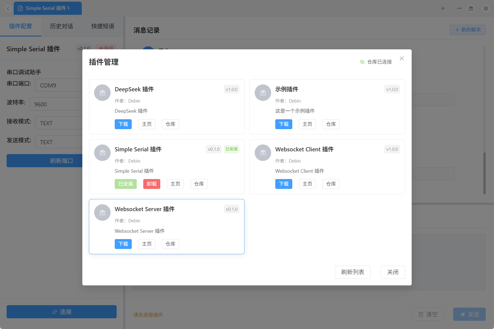
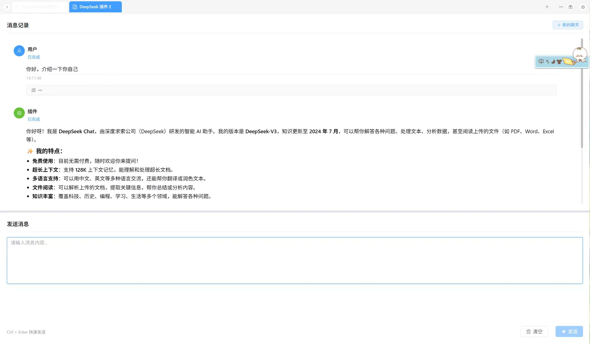
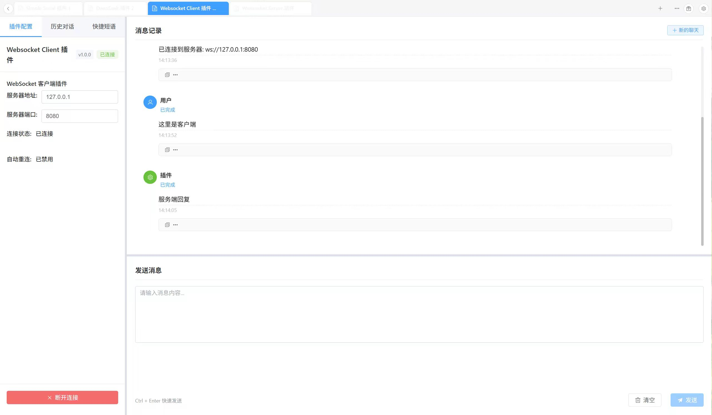
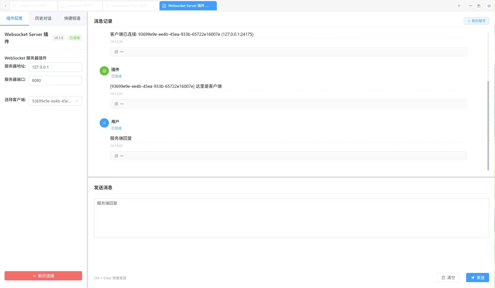
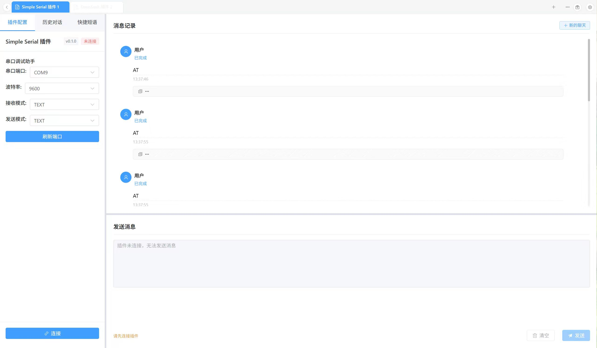

# Chat Client

A modern, extensible chat client built with Tauri, Vue 3, and Rust. Features a powerful plugin architecture that supports dynamic loading and management of chat plugins.



[中文文档](./README_zh.md)

## Features

- 🚀 **Modern Tech Stack**: Built with Tauri, Vue 3, TypeScript, and Rust
- 🔌 **Plugin Architecture**: Dynamic plugin loading and management system
- 🎨 **Responsive UI**: Resizable panels with Element Plus components
- 💬 **Messaging System**: Real-time message display and input handling
- 🔄 **Plugin Lifecycle**: Full lifecycle management (mount, unmount, connect, disconnect)
- 📦 **Cross-Platform**: Desktop app support for Windows, macOS, and Linux

## Architecture

### Frontend (Vue 3 + TypeScript)

- **Vue 3** using Composition API and `<script setup>` syntax
- **Element Plus** for UI components
- **Pinia** for state management
- **Vue Router** for navigation
- **Vite** as the build tool

### Backend (Rust + Tauri)

- **Tauri** framework for desktop app development
- **Plugin Interface** library for plugin development
- **Dynamic Loading** via `libloading` crate
- **Plugin Manager** for lifecycle management

### Plugin System

- **PluginHandler Trait**: Defines plugin lifecycle methods
- **Dynamic Loading**: Runtime plugin loading from `.dll` files
- **Bidirectional Communication**: Plugins can send/receive messages
- **Configuration Management**: Each plugin has its own `config.toml`

## Quick Start

### Prerequisites

- [Node.js](https://nodejs.org/) (v18 or later)
- [Rust](https://rustup.rs/) (latest stable)
- [pnpm](https://pnpm.io/) (recommended package manager)

### Installation

1. **Clone the repository**

   ```bash
   git clone https://github.com/luodeb/chat-client.git
   cd chat-client
   ```

2. **Install dependencies**

   ```bash
   pnpm install
   ```

3. **Run in dev mode**

   ```bash
   cd ./src-tauri
   cargo build --workspace
   pnpm tauri dev
   ```

4. **Build for production**
   ```bash
   pnpm tauri build
   ```

## Development

### Project Structure

```
chat-client/
├── src/                    # Vue frontend
│   ├── components/         # Vue components
│   ├── views/              # Vue views
│   ├── stores/             # Pinia state
│   └── api/               # API interfaces
├── src-tauri/              # Rust backend
│   ├── src/
│   │   ├── api/           # Tauri commands
│   │   ├── plugins/       # Plugin management
│   │   └── lib.rs         # Main library
│   ├── plugin-interface/  # Plugin dev library
│   └── src/plugins/       # Plugin implementations
└── dist/                  # Build output
```

### Plugin Development

Here are some example plugins that demonstrate the capabilities of the plugin system:

#### DeepSeek Chat Plugin



#### WebSocket Client Plugin



#### WebSocket Server Plugin



#### Simple Serial Plugin



Refer to [Deepseek-plugin](https://github.com/luodeb/deepseek-plugin) or [Example](src-tauri/src/plugins)

1. **Create a new plugin**

   ```bash
   cd src-tauri/src/plugins
   mkdir my-plugin
   cd my-plugin
   ```

2. **Add Cargo.toml**

   ```toml
   [package]
   name = "my-plugin"
   version = "0.1.0"
   edition = "2021"

   [lib]
   crate-type = ["cdylib"]

   [dependencies]
   plugin-interface = { path = "../../plugin-interface" }
   ```

3. **Implement the plugin**

   ```rust
   use plugin_interface::{PluginHandler, PluginMetadata};

   pub struct MyPlugin;

   impl PluginHandler for MyPlugin {
       fn on_mount(&self) -> Result<(), Box<dyn std::error::Error>> {
           // Plugin initialization
           Ok(())
       }

       fn handle_message(&self, message: &str) -> Result<String, Box<dyn std::error::Error>> {
           // Handle incoming messages
           Ok(format!("Response: {}", message))
       }

       // Implement other required methods...
   }
   ```

4. **Add config.toml**

   ```toml
   [plugin]
   id = "my-plugin"
   name = "My Plugin"
   description = "An example plugin"
   version = "1.0.0"
   author = "Your Name"
   disabled = false
   ```

5. **Export plugin functions**

   ```rust
   #[no_mangle]
   pub extern "C" fn create_plugin() -> *mut dyn PluginHandler {
       let plugin = MyPlugin::new();
       Box::into_raw(Box::new(plugin))
   }

   #[no_mangle]
   pub extern "C" fn destroy_plugin(plugin: *mut dyn PluginHandler) {
       if !plugin.is_null() {
           unsafe {
               let _ = Box::from_raw(plugin);
           }
       }
   }
   ```

### Available Scripts

- `pnpm dev` - Start dev server
- `pnpm build` - Build Vue frontend
- `pnpm tauri dev` - Run Tauri in dev mode
- `pnpm tauri build` - Build Tauri app

### Plugin Lifecycle

The plugin system supports these lifecycle methods:

- **on_mount()**: Called when plugin mounts
- **on_dispose()**: Called when plugin unmounts
- **on_connect()**: Called on connection
- **on_disconnect()**: Called on disconnection
- **handle_message()**: Called to process messages

### UI Components

Key components include:

- **ConfigPanel**: Left-side panel for plugin management
- **MessageDisplay**: Message display area
- **MessageInput**: Message input area

The UI supports draggable panel resizing for better UX.

## Recommended IDE Setup

- [VS Code](https://code.visualstudio.com/) + [Volar](https://marketplace.visualstudio.com/items?itemName=Vue.volar) + [Tauri](https://marketplace.visualstudio.com/items?itemName=tauri-apps.tauri-vscode) + [rust-analyzer](https://marketplace.visualstudio.com/items?itemName=rust-lang.rust-analyzer)

## Contributing

1. Fork this repo
2. Create your branch (`git checkout -b feature/amazing-feature`)
3. Commit changes (`git commit -m 'Add some amazing feature'`)
4. Push to branch (`git push origin feature/amazing-feature`)
5. Open a Pull Request

## License

MIT Licensed. See [LICENSE](LICENSE) for details.

## Acknowledgments

- [Tauri](https://tauri.app/) - For the excellent desktop framework
- [Vue.js](https://vuejs.org/) - For the reactive frontend framework
- [Element Plus](https://element-plus.org/) - For beautiful UI components

## FAQ

### How to add a new plugin?

1. Create a folder under `src-tauri/src/plugins/`
2. Implement the `PluginHandler` trait
3. Add `config.toml`
4. Compile to `.dll`
5. Scan and load in the app

### How to debug plugins?

Use `src-tauri/src/bin/test_plugins.rs`:

```bash
cd src-tauri
cargo run --bin test_plugins
```

### How do plugins communicate?

Plugins interact via Tauri's event system, with the frontend acting as a mediator.
